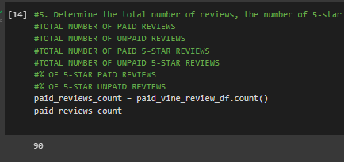

# Amazon Vine Reviews Analysis

## Overview of the analysis
Working with Jennifer on the SellBy Project, analyzing Amazon reviews written by members of the paid Amazon Vine program. The latter is a service that allows manufacturers and publishers to receive reviews for their products and SellBy pay a small fee to Amazon and provide products to Vine members who are then require to leave a review of the product.  

I have chosen to work with the one reviewing Video Games products among the 50 made available to me. [Here is a link to the data set used in this analysis.](https://s3.amazonaws.com/amazon-reviews-pds/tsv/amazon_reviews_us_Video_Games_v1_00.tsv.gz)  

After creating a Database on Amazon RDS, I linked it to my Postgres. Using the schema provided, 4 SQL tables were created and I successfully populated the them with the dataset above.  
  
  
  
  

Next, I was tasked to analyse the data using PySpark (or others, I chose PySpark since I was already working with Google Colab), to determine if there is any bias towards favourable reviews from paid and unpaid members in my dataset regarding video games products.  

## Results
Let's answer questions asked in the deliverable:  
* *How many Vine reviews and non-Vine reviews were there?*  
There was a total of 90 Vine reviews and a total of 37,831 non-Vine reviews.  
 

* *How many Vine reviews were 5 stars? How many non-Vine reviews were 5 stars?*  
There was a total of 44 Vine reviews that was 5-stars, and 14,704 non-Vine reviews at 5-star.  
 

* *What percentage of Vine reviews were 5 stars? What percentage of non-Vine reviews were 5 stars?*  
48.89% of all Vine reviews were 5-stars, and 38.87% of all non-Vine reviews were 5-stars.  

## Summary
* We can note a huge difference in the total number of Vine reviews and non-Vine reviews. Although 48.89% of Vine reviewers gave a 5-star review on the product, only 38.87% gave a 5-star review on theirs. I would say there is a bias based on paid vs non-paid reviewers on giving 5-star reviews, but the difference in the sample is way too big to be sure that there REALLY is one.

### Suggested Additional Analysis
One suggestion would be to compare reviews based per products, but also expand the reviews to include 3 and 4-stars ones so that perhaps we have a bigger sample (especially for the Vine-members) to compare and really assess whether there is a bias or not.

